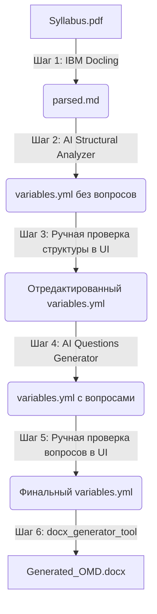

# Алгоритм работы и конвейер обработки силлабусов (TimPlan Pipeline)

В данном документе простым языком, но со всеми техническими подробностями описан алгоритм работы системы TimPlan, которая преобразует Рабочую программу дисциплины (РПД в формате PDF) в структурированные Оценочные материалы (ОМД в формате DOCX).

---

## Общая схема конвейера (Pipeline Overview)

Процесс обработки состоит из **6 последовательных шагов**, разделенных на автоматические этапы (AI/генерация) и этапы проверки человеком (Human-in-the-Loop):



---

## Подробный разбор каждого шага (Step-by-Step Details)

### Шаг 1: Парсинг PDF в Markdown (`docling_parser_tool`)
* **Задача**: Преобразовать исходный PDF-файл в текст с сохранением разметки.
* **Используемый инструмент**: IBM Docling (`DocumentConverter`).
* **Как это работает**: 
  1. PDF-документ анализируется библиотекой Docling, которая умеет распознавать таблицы, заголовки и иерархию текста.
  2. Результат экспортируется в единый Markdown-файл (`<project_name>_parsed.md`).
  3. Текст загружается во временную сессию агентов.

### Шаг 2: Извлечение структуры силлабуса (`StructuralAnalyzerAgent` + `StructuralCriticAgent`)
* **Задача**: Вытащить метаданные, списки компетенций и сетку занятий без генерации самих вопросов.
* **Алгоритм работы**:
  1. **Analyzer (Анализатор)**:
     - Читает полученный Markdown-файл.
     - Сопоставляет текст со строгой Pydantic-схемой (`OmdDataSchema`).
     - Извлекает:
       - **Метаданные**: название вуза, кафедры, ФГОС, направление подготовки, авторы и т.д.
       - **Таблицу 1**: этапы формирования компетенций (картирование разделов дисциплины).
       - **Таблицу 2**: декомпозицию компетенций (индикаторы "Знать", "Уметь", "Владеть" из текста РПД).
       - **Список занятий (Table 4)**: Лекции, семинары и лабораторные работы с указанием тем, часов, кодов компетенций и используемых оценочных средств.
     - **Важно**: Все списки вопросов (`questions`) и оценочные задания (курсовые, кейсы, экзамены) на этом шаге принудительно оставляются пустыми (`[]` или `null`).
  2. **Critic (Критик)**:
     - Проверяет извлеченную структуру по чек-листу: все ли компетенции на месте, совпадает ли сетка часов с РПД, действительно ли списки вопросов пустые.
     - Если проверка пройдена, вызывается инструмент `exit_loop`. В противном случае Анализатор получает замечания и перечитывает документ.
  3. Результат сохраняется в `variables.yml` в папке проекта.

### Шаг 3: Проверка структуры пользователем (Web UI - Шаг 3)
* **Задача**: Зафиксировать костяк дисциплины, чтобы AI не генерировал вопросы по неверным темам.
* **Как это работает**:
  - На странице переменных в UI отображаются вкладки "Основная информация", "Список занятий" и "Таблицы компетенций".
  - Пользователь проверяет правильность кодов, названия разделов, форму обучения и темы лекций/семинаров. При необходимости редактирует поля напрямую.
  - Нажатие кнопки **«Генерация вопросов»** сохраняет изменения в `variables.yml` и запускает следующий AI-этап.

### Шаг 4: Генерация вопросов и оценочных средств (`QuestionsGeneratorAgent` + `QuestionsCriticAgent`)
* **Задача**: Сформировать качественные академические вопросы и контрольные задания на основе утвержденной структуры.
* **Алгоритм работы**:
  1. **Generator (Генератор вопросов)**:
     - Загружает отредактированный `variables.yml` и исходный Markdown.
     - Читает параметры генерации (например, сколько вопросов нужно сгенерировать на одну лекцию или семинар).
     - Генерирует в соответствии с параметрами:
       - Списки вопросов к каждому занятию в сетке.
       - Билеты/вопросы к зачетам и экзаменам.
       - Варианты контрольных работ.
       - Описания индивидуальных и групповых кейсов/проектов.
       - Подробные критерии оценивания для каждой активной формы контроля (для оценок 5, 4, 3, 2).
     - **Важно**: Генератор строго сохраняет структуру метаданных, утвержденную на Шаге 3, и не меняет темы занятий или коды компетенций.
  2. **Critic (Критик)**:
     - Проверяет количество сгенерированных вопросов в соответствии с конфигурационными параметрами.
     - Убеждается, что критерии оценивания логичны, а вопросы сформулированы на академическом русском языке.
  3. Результат перезаписывает `variables.yml`.

### Шаг 5: Проверка вопросов пользователем (Web UI - Шаг 5)
* **Задача**: Дать пользователю возможность вычитать сгенерированные вопросы и внести финальные правки перед компиляцией.
* **Как это работает**:
  - В веб-интерфейсе становятся активными вкладки "Контроль", "Задания" и "Прочее".
  - Пользователь видит сгенерированные билеты, варианты контрольных, кейсы и вопросы к лекциям.
  - При необходимости добавляет, удаляет или переписывает вопросы.
  - После сохранения нажимает кнопку **«Сгенерировать Word документ»**.

### Шаг 6: Сборка и стилизация документа (`docx_generator_tool`)
* **Задача**: Создать красиво отформатированный файл `.docx` по строгому академическому шаблону.
* **Алгоритм работы**:
  1. **Очистка данных (Text Cleaning)**:
     - **Слияние слогов**: Устраняются разрывы слов и дефисы посреди строк, возникшие при распознавании PDF (например, `Зоо- гигиена` преобразуется в `Зоогигиена`).
     - **Удаление префиксов**: Из списков вопросов вырезается нумерация вроде `1. `, `a) `, `- `, так как Word будет нумеровать списки автоматически.
  2. **Рендеринг шаблона**:
     - Данные из `variables.yml` подставляются в файл разметки `templates/OMD_template.docx` (с помощью `DocxTemplate`, поддерживающей синтаксис Jinja2 для docx-файлов).
  3. **Применение визуальных стилей (Style Normalization)**:
     - Чтобы итоговый документ выглядел профессионально и идентично эталонному `OMD_example_readonly.docx`, к нему программно применяются следующие правила:
       - **Поля страницы**: Верхнее — 1.5 см (0.59"), Нижнее — 2.0 см (0.79"), Левое — 2.5 см (0.98"), Правое — 1.5 см (0.59").
       - **Шрифты**: Весь текст переводится в Times New Roman.
       - **Абзацы**: Основной текст выравнивается по ширине (`JUSTIFY`), размер — 14pt, межстрочный интервал — 1.15.
       - **Заголовки занятий**: Строки, начинающиеся со слов "Лекция №...", "Практическое занятие №...", "Вопросы к..." выравниваются по левому краю, делаются жирными (`bold = True`) и получают размер 14pt.
       - **Таблицы**: Текст внутри таблиц форматируется размером 12pt, выравнивается по ширине (первый столбец — по центру), межстрочный интервал сжимается для компактности.
       - **Очистка артефактов**: Удаляются любые зеленые подсветки текста и синие цвета шрифтов, оставшиеся от отладки.
  4. Готовый документ сохраняется в папку `results/<project_name>/` и становится доступным для скачивания.

---

## Архитектура CLI (Интерфейс командной строки)

Благодаря разделению логики, вы можете запустить любой шаг конвейера вручную из консоли (как на хосте, так и внутри Docker-контейнера). 

**Команда запуска**:
```bash
python3 main.py --project <имя_проекта> --step <шаг> [--regenerate]
```

### Доступные шаги (`--step`):
* `parse` — парсинг PDF в Markdown (Шаг 1).
* `extract_structure` — извлечение структуры в `variables.yml` (Шаг 2).
* `generate_questions` — генерация вопросов в `variables.yml` (Шаг 4).
* `generate_docx` — сборка финального Word-файла (Шаг 6).
* `all` — последовательный запуск всех шагов без пауз.

Флаг `--regenerate` принудительно перезапускает шаг, даже если соответствующий файл уже существует на диске (полезно, если нужно стереть прошлые результаты и начать заново).
